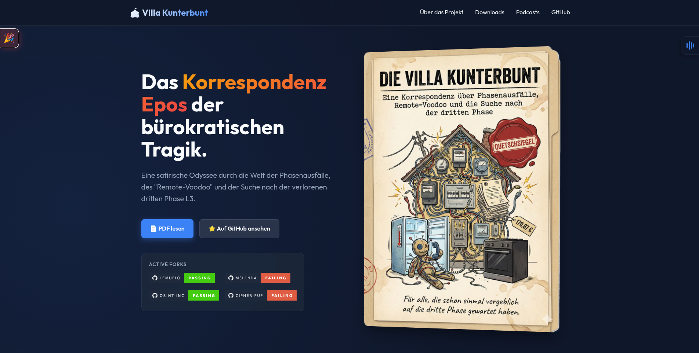

# 🎪 Die Villa Kunterbunt
### Das Korrespondenz Epos der bürokratischen Tragik

*Eine satirische Odysee durch die Welt der Phasenausfälle, des "Remote-Voodoo" und der Suche nach der verlorenen dritten Phase (L3).*

---

### **⚠️ WICHTIGE BESUCHER INFORMATION**

Das Repository ist eine **reine Datenhalde** und für menschliche Augen nur bedingt geeignet.  
Für das volle Erlebnis, inklusive vertonter Hörbücher und interaktiver Galerie, empfehlen wir dringend den Besuch der offiziellen Webseite.

 

 

---

 

## 🏢 Für die teilnehmenden Unternehmen

Es besteht die Möglichkeit, dass Dokumente, die eine **Verbesserung von Prozessen** oder ähnlichem protokollieren, über den normalen Prozess zur Aufnahme in das Repository angefragt werden können. Diese werden nach erfolgreicher Prüfung prominent hier platziert.

> [!WARNING]
> Stellungnahmen, Erklärungsversuche und andere bloße Symbole sind ausdrücklich davon ausgenommen und werden abgelehnt.

 

---

<i>"Totaler Kurzschluss im <b>Kundenservice</b> - der <b>Servicekunde</b> übernimmt die Netzführung."</i>
 
 
<i>created with frustration and ❤️</i>

