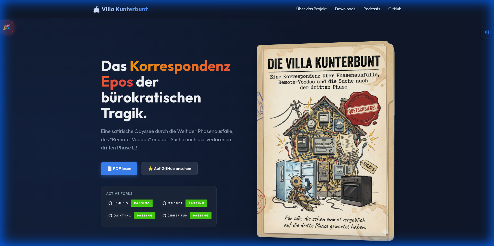

  # 🎪 Die Villa Kunterbunt
### Das Korrespondenz Epos

*Eine satirische Odysee durch die Welt der Phasenausfälle, des "Remote-Voodoo" und der Suche nach der verlorenen dritten Phase.*

---

> **✨ Die Villa Kunterbunt – Das Erlebnis.**
> Für Besucher ist die Webseite der einzig wahre Ort. Hier wird der Wahnsinn nicht nur verwaltet, sondern zelebriert.
>
> 👉 **[JETZT EINTRETEN](https://derlemue.github.io/villa-kunterbunt/)**

Das Projekt wurde restrukturiert. Alle Inhalte befinden sich nun in der strukturierten Datenablage.

👉 **[ZUM DATEN-VERZEICHNIS](core/)**

---

## 🏢 Hinweis für die teilnehmenden Unternehmen

Es besteht die Möglichkeit, dass Dokumente, die eine **Verbesserung von Prozessen** oder ähnlichem protokollieren, über den normalen Prozess zur Aufnahme in das Repository angefragt werden können. Diese werden nach erfolgreicher Prüfung prominent hier in der README.md platziert.

> [!WARNING]
> Stellungnahmen, Erklärungsversuche und andere bloße Symbole sind ausdrücklich davon ausgenommen und werden abgelehnt.

---

<i>"Totaler Kurzschluss im <b>Kundenservice</b> - der <b>Servicekunde</b> übernimmt die Netzführung."</i>
 
 
<i>created with frustration and ❤️</i>

