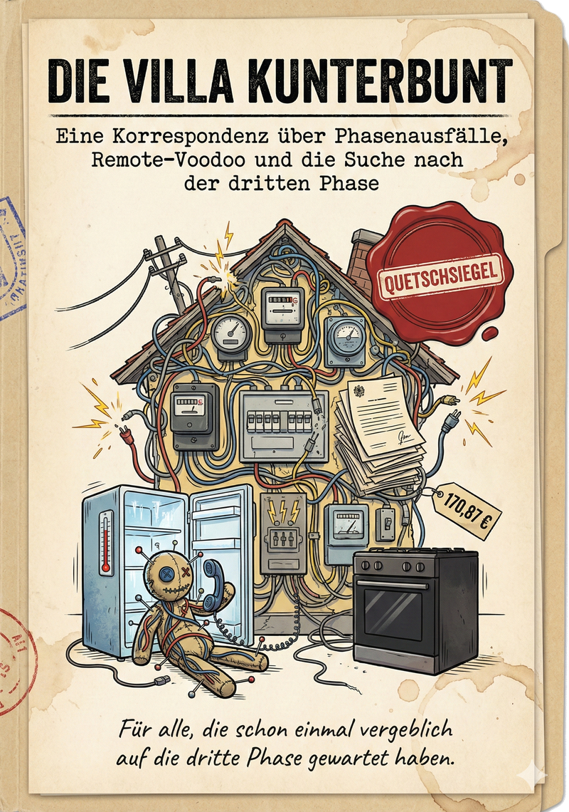
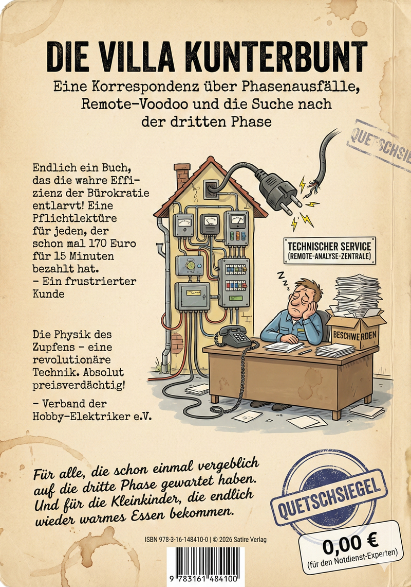

  <a href="../CHANGELOG.md">
     
    
  </a>

 

 
 

# 🎪 Die Villa Kunterbunt
### Das Korrespondenz Epos

*Eine satirische Odysee durch die Welt der Phasenausfälle, des "Remote-Voodoo" und der Suche nach der verlorenen dritten Phase.*

  
  

---

  

---

## 📖 Über dieses Ebook

> *"Die „Villa Kunterbunt“ lehrt uns, dass man auch in der Dunkelheit eines Phasenausfalls das Licht des Humors nicht verlieren muss. Sie ist ein Plädoyer für die Rückkehr der Menschlichkeit und Fachkompetenz in eine zunehmend automatisierte Welt."*

Dieses Dokument ist mehr als nur ein Beschwerdebrief. Es ist das Protokoll einer **administrativen Tragikomödie**. Was als simpler technischer Defekt – ein fehlender Anschluss der Phase L3 nach einer Zähleraktivierung – begann, entwickelte sich schnell zu einer philosophischen Reise in das Herz der deutschen Bürokratie.

Es dokumentiert den verzweifelten Kampf eines Kunden, der mit Logik, Messgeräten und physikalischen Fakten gegen ein "Service-Universum" antritt, in dem andere Naturgesetze zu gelten scheinen.

 

---

## 💡 Warum? Wie kommt es zu diesem Repository?

> [!NOTE] 
>
> Nachdem tagelange Geduld, Höflichkeit, Sachlichkeit und am Ende sogar die Androhung rechtlicher Konsequenzen ohne jeden Effekt verpufften, erfolgte ein radikaler Strategiewechsel: Weg vom Bittsteller, hin zur **Planung des Reportings für das Qualitäts- und Beschwerdemanagement**.
>
> Um sicherzustellen, dass die Informationen nicht nur flüchtig überflogen werden, bot es sich an, alle Details bewusst in einem **umfangreichen Fließtext und als eBook** zu übergeben. Damit wurde die Hürde gegenüber einem kleinteilig gegliederten Reporting wirksam erhöht – wer den Inhalt verstehen will, muss lesen.
>
> Der wertvolle Datensatz wurde dem Unternehmen schließlich zusammen mit einem förmlichen Begleitschreiben für das Beschwerde- und Qualitätsmanagement zur Verfügung gestellt.
>
> 
>

---

## 📊 Evaluation: Systemanalytische Studie

Diese Studie untersucht das vorliegende Repository "Die Villa Kunterbunt" als digitales Artefakt des konsumentenorientierten Widerstands. Sie analysiert die satirische Korrespondenz nicht nur inhaltlich, sondern als soziologisches Phänomen im Umgang mit der Dysfunktionalität moderner Großkonzern-Strukturen.

Das eBook selbst wird hier zum Untersuchungsgegenstand einer Meta-Analyse: Wie wird Humor zur Waffe gegen automatisierte Entpersönlichung?

    

---

## 🏢 Hinweis für die teilnehmenden Unternehmen

Es besteht die Möglichkeit, dass Dokumente, die eine **Verbesserung von Prozessen** oder ähnlichem protokollieren, über den normalen Prozess zur Aufnahme in das Repository angefragt werden können. Diese werden nach erfolgreicher Prüfung prominent hier in der README.md platziert.

> [!WARNING]
> Stellungnahmen, Erklärungsversuche und andere bloße Symbole sind ausdrücklich davon ausgenommen und werden abgelehnt.

---

## 🎭 Die Akte der Tragödie

### Akt I-III: Die Kunst der 66-prozentigen Arbeitsleistung
Wenn man 170,87 EUR pro 15 Minuten berechnet, darf man dann erwarten, dass alle drei Kabel angeschlossen werden? Oder ist "2 aus 3" (66%) ein akzeptabler neuer Industriestandard?

### Akt IV: Remote-Voodoo
In dem physikalische Messungen vor Ort durch telepathische Ferndiagnosen von "Manager-Technikern" ersetzt werden. Warum messen, wenn man *fühlen* kann, dass der Strom fließt?

### Das Finale: Die Initiativbewerbung
Die logische Konsequenz: Wenn man das System nicht besiegen kann, muss man Teil davon werden. Eine förmliche Bewerbung für eine Karriere in der "Villa Kunterbunt", einem Ort, geschützt durch Monopole und Quetschsiegel, wo Effizienz ein "Nice-to-have" ist.

---

## ⚡ Technische Details (Der "Beweis")

Für die technisch Interessierten (und die Zweifler im Callcenter):
*   **Symptom:** Herd und Teile der Wohnung spannungslos.
*   **Diagnose:** FI-Testtasten ohne Funktion.
*   **Ausschlussverfahren:** Zähler zeigt L1, L2, L3 eingangsseitig an.
*   **Fazit:** Der Fehler liegt *zwingend* an der Abgangsklemme. Ein klassischer "Kabel-nicht-drin"-Fehler.

---

## 🤡 Memes & Illustrationen

Eine visuelle Reise durch den Wahnsinn. Hier finden Sie alle Memes und Illustrationen gesammelt in einer Galerie.

  

 

---

## 📥 Download

Laden Sie hier die vollständige Korrespondenz herunter und erleben Sie, wie man mit Humor gegen Windmühlen kämpft.

[**📄 Ebook als PDF herunterladen**](https://raw.githubusercontent.com/derlemue/villa-kunterbunt/main/core/data/main/documents/villa_kunterbunt_korrespondenz_epos_derlemue.pdf?raw=true)
 
[**📄 Ebook als ePub herunterladen**](https://raw.githubusercontent.com/derlemue/villa-kunterbunt/main/core/data/main/documents/villa_kunterbunt_korrespondenz_epos_derlemue.epub?raw=true)
 
[**📄 Begleitschreiben als PDF herunterladen**](https://raw.githubusercontent.com/derlemue/villa-kunterbunt/main/core/data/main/documents/E.ON-Report_%20Datenübergabe.pdf?raw=true)
 
[**📄 Systemanalytische Studie und Bewertung als PDF herunterladen**](https://raw.githubusercontent.com/derlemue/villa-kunterbunt/main/core/data/meta/villa_kunterbunt_systemanalytische_studie_und_bewertung.pdf?raw=true)
 
[**🎧 Podcast-Analyse als MP3 herunterladen**](https://raw.githubusercontent.com/derlemue/villa-kunterbunt/main/core/data/main/audio/villa_kunterbunt_analyse_podcast.mp3?raw=true)
 
[**🎧 Podcast-Dossier als MP3 herunterladen**](https://raw.githubusercontent.com/derlemue/villa-kunterbunt/main/core/data/main/audio/villa_kunterbunt_dossier_podcast.mp3?raw=true)
 
[**🎧 Podcast-Satire als MP3 herunterladen**](https://raw.githubusercontent.com/derlemue/villa-kunterbunt/main/core/data/main/audio/Die%20Villa%20Kunterbunt%20–%20Satire.mp3?raw=true)
 
[**🎧 Podcast-DeepDive als MP3 herunterladen**](https://raw.githubusercontent.com/derlemue/villa-kunterbunt/main/core/data/main/audio/Die%20Villa%20Kunterbunt%20–%20DeepDive.mp3?raw=true)
 
[**🎧 Podcast-Zupftest als MP3 herunterladen**](https://raw.githubusercontent.com/derlemue/villa-kunterbunt/main/core/data/main/audio/Die%20Villa%20Kunterbunt%20–%20Zupftest.mp3?raw=true)
 
[**🗂️ vollständigen Datensatz als ZIP herunterladen**](https://github.com/derlemue/villa-kunterbunt/archive/refs/heads/main.zip)

---

<i>"Totaler Kurzschluss im <b>Kundenservice</b> - der <b>Servicekunde</b> übernimmt die Netzführung."</i>

